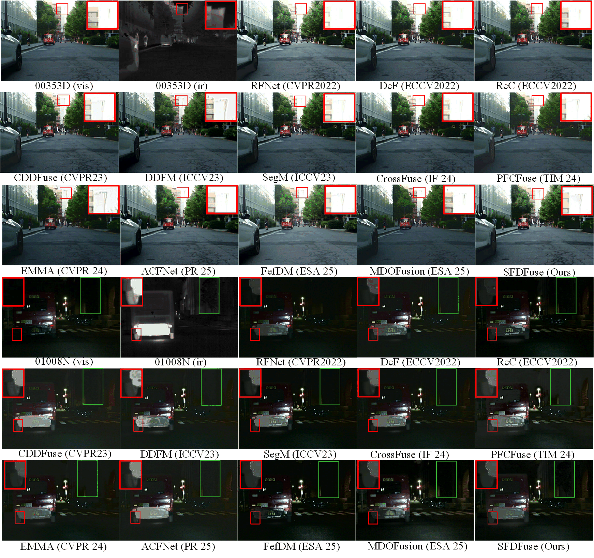
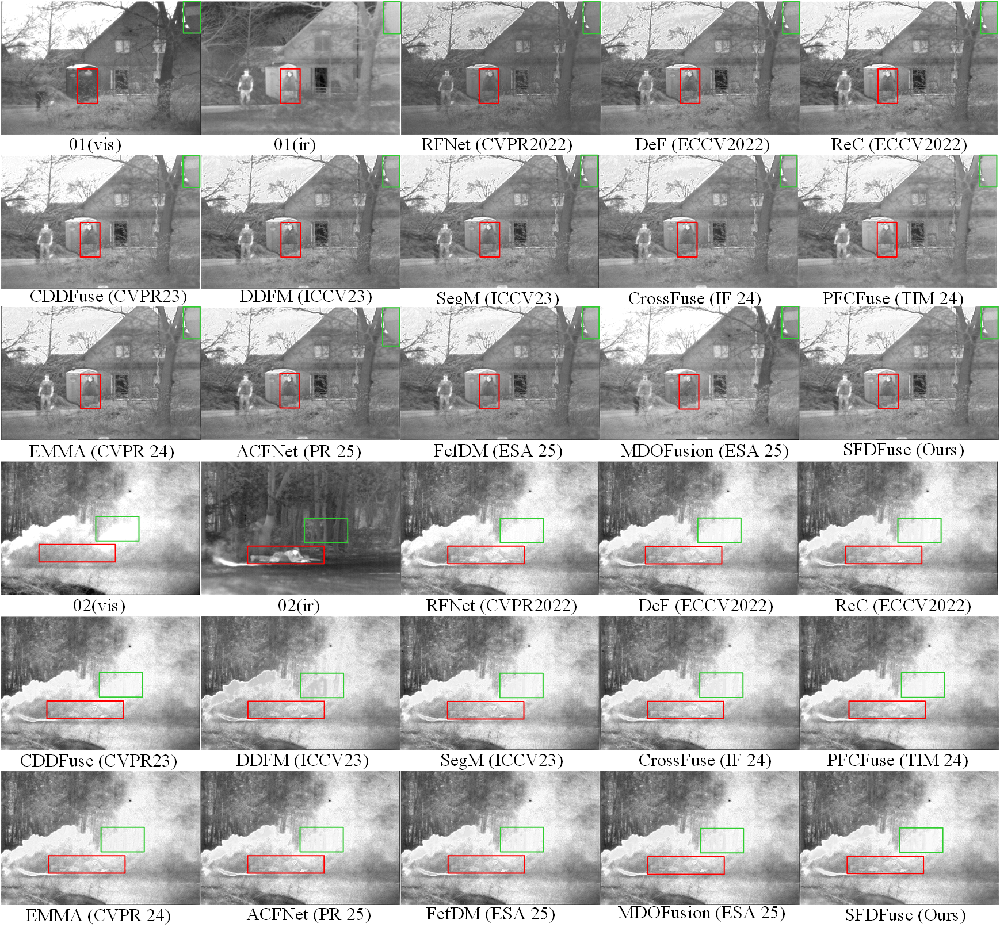
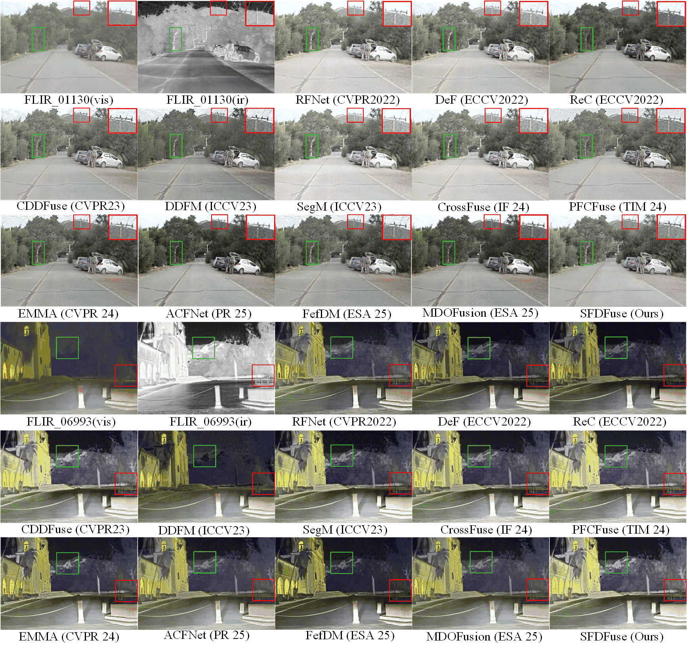
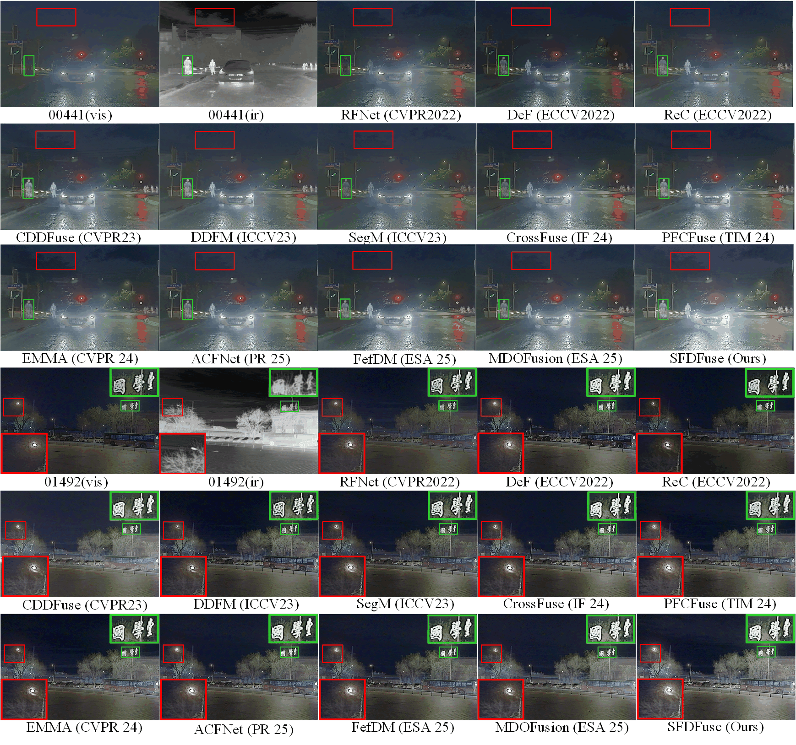
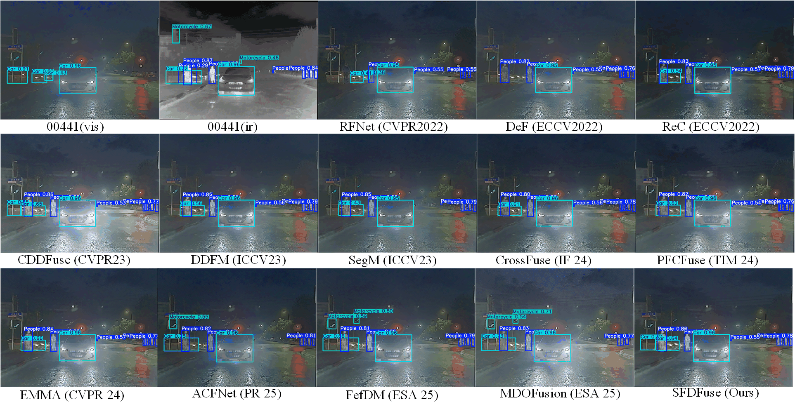
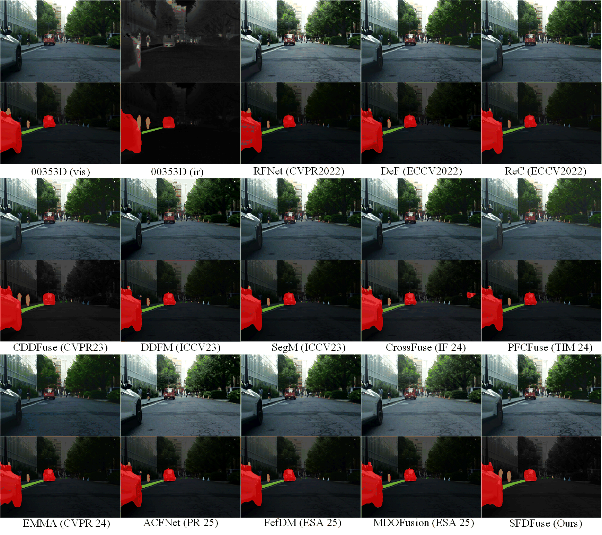

# SFDFuse
Codes for ***SFDFuse: Spatial and Frequency Feature Decomposition for Visible and Infrared Image Fusion.***

[Xupei Zhang](https:///)
-[*[Paper]*]()  
-[*[ArXiv]*]()  
-[*[Supplementary Materials]*]()  


## Update
- [2025/1] Release inference code for infrared-visible image fusion, Training codes and config files are public available.


## Abstract

Visible and infrared image fusion(VIIF) aims to integrate complementary information from multiple imaging modalities to produce high-quality fused images for various downstream tasks. In this paper, we present SFDFuse, a dual-branch network that jointly exploits spatial and frequency features to address the limitations of existing fusion methods in preserving essential details and balancing global and local information. Moreover, the SFDFuse introduces a hierarchical Transformer-CNN module, which extracts a unified and information-rich representation, laying a robust foundation for subsequent fusion by preserving key structural and contextual details from all modalities. For the deep-level feature extraction, enhanced with learnable wavelet transforms and targeted convolutional structures, SFDFuse substantially improves the preservation of essential details and the overall consistency of fused images. During the feature fusion stage, the designed adaptive fusion modules with cross-attention and gated mechanisms enable deep interactions across modalities and feature scales, promoting robust integration of complementary cues. Finally, quantitative and qualitative evaluations on multiple benchmarks demonstrate the superior performance and stability of SFDFuse, with further improvements observed in the downstream tasks.

## 🌐 Usage

### ⚙ Network Architecture

Our SFDFuse is implemented in ``net.py``.

### 🏊 Training
**1. Virtual Environment**
```
# create virtual environment
conda create -n SFDfuse python=3.8.10
conda activate SFDfuse
# select pytorch version yourself
# install SFDfuse requirements
pip install -r requirements.txt
```

**2. Data Preparation**

Download the MSRS dataset from [this link](https://github.com/Linfeng-Tang/MSRS) and place it in the folder ``'./MSRS_train/'``.

**3. Pre-Processing**

Run 
```
python dataprocessing.py
``` 
and the processed training dataset is in ``'./data/MSRS_train_imgsize_128_stride_200.h5'``.

**4. SFDFuse Training**

Run 
```
python train.py
``` 
and the trained model is available in ``'./models/'``.

### 🏄 Testing

**1. Pretrained models**

Pretrained models are available in ``'./models/SFDFuse_best.pth'`` , which is responsible for the Infrared-Visible Fusion (IVF). 

**2. Test datasets**

The test datasets used in the paper have been stored in ``'./test_img/MSRS'``,``'./test_img/RoadScene'``, ``'./test_img/TNO'``,``'./test_img/M3FD'`` for IVF.

Unfortunately, since the size of train and test dataset is over 500+MB, we can not upload them for exhibition. It can be downloaded via the links in data/datasetlink.txt and test_data/datasetlinks.txt.

**3. Results in Our Paper**

If you want to infer with our CDDFuse and obtain the fusion results in our paper, please run 
```
python test.py
``` 
for Infrared-Visible Fusion

The testing results will be printed in the terminal. 

The output for ``'test.py'`` is:

```
================================================================================
The test result of MSRS :
                 EN      SD      SF      MI     SCD     VIF     Qabf    SSIM
SFDFuse         6.70    43.40    11.59   3.54    1.65    1.06    0.71    1.00
================================================================================

================================================================================
The test result of TNO :
                 EN      SD      SF      MI     SCD     VIF     Qabf    SSIM
SFDFuse         7.16    46.17    13.24   2.29    1.74    0.81    0.56    1.02
================================================================================

================================================================================
The test result of RoadScene :
                 EN      SD      SF      MI     SCD     VIF     Qabf    SSIM
SFDFuse         7.43    52.80   15.63   2.37     1.80    0.70    0.55    0.96
================================================================================

================================================================================
The test result of TNO :
                 EN      SD      SF      MI     SCD     VIF     Qabf    SSIM
SFDFuse         6.93    38.02    14.96   2.98    1.59    0.83    0.63    1.01
================================================================================
```
which can match the results in Table 1 in our original paper.


## 🙌 SFDFuse

### Illustration of our SFDFuse model.


### Quantitative fusion results.

Infrared-Visible Image Fusion






MM detection



MM segmentation



## Related Works

```
- Zixiang Zhao, Haowen Bai, Jiangshe Zhang, Yulun Zhang, Kai Zhang, Shuang Xu, Dongdong Chen, Radu Timofte, Luc Van Gool. *Equivariant Multi-Modality Image Fusion.* **arXiv:2305.11443**, https://arxiv.org/abs/2305.11443

- Zhao, Z., Bai, H., Zhang, J., Zhang, Y., Xu, S., Lin, Z., Timofte, R., Van Gool, L., 2023a. Cddfuse: Correlation-driven dual-branch feature decomposition for multi-modality image fusion, in: Proceedings of the IEEE/CVF conference on computer vision and pattern recognition, pp.5906–5916.

- Hu, X., Liu, Y., Yang, F., 2024. Pfcfuse: A poolformer and cnn fusion network for infrared-visible image fusion. IEEE Transactions on Instrumentation and Measurement.

- Li, H., Wu, X.J., 2024. Crossfuse: A novel cross attention mechanism based infrared and visible image fusion approach. Information Fusion 103,102147.

- Li, H., Wu, X.J., Kittler, J., 2021. Rfn-nest: An end-to-end residual fusion network for infrared and visible images. Information Fusion 73, 72–86.

-Chen X, Xu S, Hu S, et al. ACFNet: An adaptive cross-fusion network for infrared and visible image fusion. Pattern Recognition, 2025, 159: 111098.

-Li J, Wang Y, Ning X, et al. FefDM-Transformer: Dual-channel multi-stage Transformer-based encoding and fusion mode for infrared–visible images. Expert Systems with Applications, 2025, 277: 127229.

-Liu T, Chen B, Wang B, et al. MDOFusion: A visible and infrared image fusion method based on multi-dimensional quantification allocation and dual optimization mechanism[J]. Expert Systems with Applications, 2025, 280: 127463.

```


## Citation

```

```


